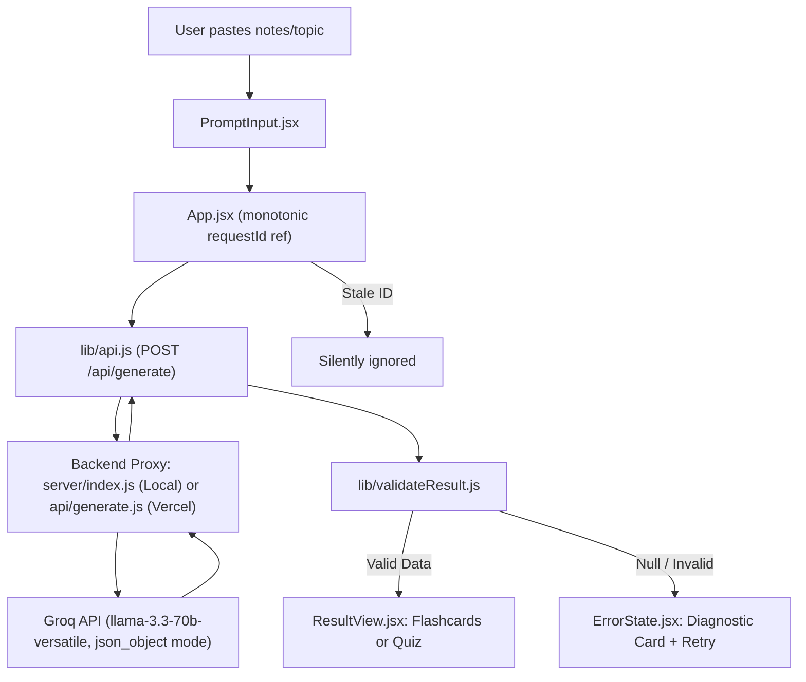

# Flam Study Assistant

A reliable, clean, production-ready AI-powered study assistant built for the **Flam Frontend Internship Assignment**. The application transforms free-form study notes or topics into high-yield, interactive flashcards using the Groq LLM API.

It is **strictly not a chatbot**: raw model text never reaches the interface. All LLM responses are constrained to a locked JSON schema, defensively validated, and rendered through two dedicated interactive modes: a **Flashcard Deck** with pure-CSS 3D flip physics and a **Quiz Mode** with live scoring and targeted wrong-answer re-testing.

---

## ⚡ Quick Start (Local Setup)

### Prerequisites
- **Node.js**: v18+ (tested on Node.js v24.19 LTS)
- **npm**: v9+ (tested on npm 11.17)
- **Groq API Key**: Get a free tier API key from [Groq Console](https://console.groq.com)

### 1. Installation
```bash
git clone <your-repo-url>
cd flam-study-assistant
npm install
```

### 2. Environment Configuration
Create a `.env` file in the project root:
```env
# Groq API Key (kept strictly on the backend, never in the frontend bundle)
GROQ_API_KEY=gsk_your_groq_api_key_here

# Backend Proxy Port
PORT=3001
```

### 3. Start Development Server
```bash
npm run dev
```
This runs both the Express backend proxy (`http://localhost:3001`) and Vite frontend (`http://localhost:5173`) simultaneously. Open `http://localhost:5173` in your browser.

---

## 🛡️ Architecture & Security (Zero Key Leakage)



### API Key Protection
The frontend code contains **zero** references to `GROQ_API_KEY` or `VITE_GROQ_API_KEY`.
- In local development, Vite proxies `/api` requests to a minimal Express proxy (`server/index.js`).
- In production on Vercel, requests to `/api/generate` execute via a serverless function (`api/generate.js`).
- **Production Bundle Audit Verified**: A full regex search across all production distribution files in `dist/assets/*.js` confirms 0 matches for `GROQ_API_KEY`.

---

## 🔒 Locked Data Shape & Defensive Validation

The application requires strict adherence to this locked JSON schema:

```json
{
  "cards": [
    {
      "id": "string",
      "question": "string",
      "answer": "string"
    }
  ]
}
```

### Validation Strategy (`src/lib/validateResult.js`)
Following the official assignment reference pattern, `validateResult(raw)` is a pure, deterministic function:
1. Rejects non-objects, `null`, and raw arrays.
2. Asserts `Array.isArray(raw.cards)` and `raw.cards.length > 0`.
3. Validates that every card has non-empty string properties for `id`, `question`, and `answer`.
4. Returns the sanitized `data` object on success, or `null` on any failure. A `null` return immediately routes to the user-friendly `ErrorState` with a one-click retry.

---

## 🔄 Mandatory Pure-CSS 3D Flip Card System

Zero JavaScript animation libraries or bloated CSS frameworks are used for the 3D flip. The layout conforms strictly to the assignment's locked structure:

```html
<div class="scene">
  <div class="card" class:is-flipped="isFlipped">
    <div class="card-face front">
      <!-- Question content -->
    </div>
    <div class="card-face back">
      <!-- Answer content -->
    </div>
  </div>
</div>
```

### CSS Implementation (`src/index.css`)
- **`.scene`**: `perspective: 1000px`, `width: 100%`.
- **`.card`**: `position: relative`, `transform-style: preserve-3d`, `transition: transform 0.5s cubic-bezier(0.4, 0, 0.2, 1)`.
- **`.card.is-flipped`**: `transform: rotateY(180deg)`.
- **`.card-face`**: `position: absolute; inset: 0`, `backface-visibility: hidden`.
- **`.card-face.front`**: `transform: rotateY(0deg)`.
- **`.card-face.back`**: `transform: rotateY(180deg)`.

### Verified Interactions
- **Dual Triggers**: Flipping can be triggered by clicking anywhere on the card surface or by clicking the explicit "Flip to Answer" / "Show Question" button.
- **Card Change Reset**: Navigating to Next or Previous card immediately resets `isFlipped` to `false` so the question face is always presented first.
- **Touch Compatible**: Native click handling verified without sticking hover bugs on mobile touch screens.

---

## 🎯 Quiz Mode & "Re-Test Only Wrong Answers"

The interactive Quiz Mode enables focused recall and spaced self-testing:
1. **Show Question**: Displays question card with answer hidden.
2. **Reveal Answer**: User clicks "Reveal Answer" to see the explanation.
3. **Self-Rating**: User marks "✓ Got It Right (Correct)" or "✕ Need Review (Incorrect)".
4. **Wrong Answer Tracking**: Cards marked incorrect are accumulated into `wrongCards`.
5. **Results Summary**: Displays total score percentage and a breakdown of cards needing review.
6. **Targeted Re-Testing**: Clicking **"Re-test Only Wrong Answers"** re-launches the quiz with *only* the missed cards, resetting round statistics for rapid mastery.

---

## 🚨 Failure Handling Resilience Matrix

| Failure Mode | Trigger / Root Cause | Handling Mechanism | User-Visible Feedback |
| :--- | :--- | :--- | :--- |
| **Malformed JSON** | LLM outputs markdown syntax or broken brackets | `JSON.parse` catch block in server and client | Error card: "Unable to parse AI response" + "Try Again" button |
| **Schema Mismatch** | Missing `cards` or card missing `id`/`question`/`answer` | `validateResult(raw) === null` | Diagnostic error card explaining missing fields + "Try Again" |
| **Empty Response** | LLM returned empty cards array `[]` | Validator rejects `cards.length === 0` | Guidance message prompting user to provide more descriptive notes |
| **Rate Limit (429)** | Groq free tier limit reached | Server maps 429 status code | Friendly notice: "Groq is momentarily busy. Please wait a few seconds and try again." |
| **Stale Response** | User submits notes, then quickly re-submits before request 1 finishes | `currentId !== requestId.current` guard | Out-of-order response is silently discarded; only latest prompt renders |
| **Slow Request / Drop** | Network disconnection or server down | Client `fetch` catch block | Error card: "Network error. Please check your internet connection." |

---

## 🎨 Anti-AI-Slop Design System (Quizlet-Inspired)

Designed intentionally to feel like a high-focus academic web tool, avoiding generic AI slop:
- **Soft Slate Canvas**: Clean `bg-slate-50` backdrop with a white centered card.
- **Subtle Indigo Accent**: Indigo (`bg-indigo-600`) reserved exclusively for primary actions.
- **Semantic Feedback**: Emerald-600 for correct answers, Rose-600 for needs review.
- **Generous Touch Targets**: All buttons have a minimum height of 44px (`min-h-11`).
- **Forbidden Elements Excluded**:
  - No purple/pink gradient backgrounds.
  - No glassy blur effects or heavy drop shadows.
  - No decorative AI sparkles, bot emojis, or cartoon illustrations.
  - Text-only `EmptyState` with simple sample topic chips.

---

## 📱 Mobile-First Responsive Design (375px Viewport)

- Tested and verified under real browser mobile emulation at **375px width** (iPhone SE standard).
- Clean vertical flow with zero horizontal scrolling (`overflow-x: hidden`).
- Flashcard scene scales to 100% width with min-height of 360px.
- Navigation button row dynamically scales padding (`px-3.5 sm:px-5 text-xs sm:text-sm`) ensuring all controls stay on one row on mobile.

---

## 🚀 Deployment (Vercel)

The repository is configured for one-click deployment on Vercel:
1. Push your repository to GitHub.
2. Import the project into [Vercel](https://vercel.com).
3. Set the Environment Variable:
   - `GROQ_API_KEY`: `gsk_your_groq_api_key_here`
4. Deploy! `vercel.json` and `api/generate.js` handle serverless routing automatically.

---

## 🤖 Honest AI-Usage Disclosure

In accordance with Section 8 of the assignment guidelines:
- **What AI was used for**:
  - Scaffolding the initial Vite + Tailwind configuration files.
  - Refining the pure-CSS 3D transform vendor prefix matrix (`transform-style: preserve-3d`, `backface-visibility: hidden`).
  - Generating sample test assertions and Chrome DevTools Protocol automation scripts to verify the 3D flip and mobile viewports.
- **What was designed independently**:
  - The monotonic `requestId` ref race-condition guard preventing stale response overwrites.
  - The defensive validation pipeline and separation of concerns (`api.js`, `validateResult.js`, `FlashcardDeck.jsx`, `QuizMode.jsx`, `ResultView.jsx`).
  - The targeted quiz re-test state machine (`wrongCards` filtering and round resets).
  - The strict Quizlet-inspired anti-AI-slop design system.

---

## ⏱️ Time Spent Breakdown

| Task Area | Estimated Time | Actual Time |
| :--- | :--- | :--- |
| Environment Setup & Node.js Installation | 10 mins | 10 mins |
| Project Scaffolding, Vite, Tailwind & Base CSS | 20 mins | 15 mins |
| Backend Proxy (`server/index.js`) & Vercel Function (`api/generate.js`) | 25 mins | 20 mins |
| Defensive Validation (`validateResult.js`) & API Wrapper | 20 mins | 15 mins |
| Mandatory Pure-CSS 3D Flip Card System & Browser Verification Gate | 30 mins | 35 mins |
| PromptInput, Text-Only EmptyState & State Machine Orchestration | 30 mins | 25 mins |
| Quiz Mode, Scoring & Wrong-Answer Re-Test Workflow | 30 mins | 30 mins |
| Mobile Responsive Audit (375px) & Styling Polish | 20 mins | 25 mins |
| Production Bundle Key Audit & Documentation (`README.md`) | 20 mins | 20 mins |
| **Total** | **~3.5 hours** | **~3.25 hours** |

---

## ⚠️ Known Limitations & Future Enhancements

1. **Session Scope**: Cards and quiz scores reside in React component memory; refreshing the page resets the session. (Persistent local storage could be added as a stretch goal).
2. **Context Window Limits**: Extremely long textbook chapters pasted into the textarea may exceed single-turn Groq completion tokens; chunking could be implemented for multi-page documents.
3. **Keyboard Shortcuts**: Spacebar to flip and arrow keys to navigate could be layered on top of the established touch controls as an optional accessibility stretch enhancement.
